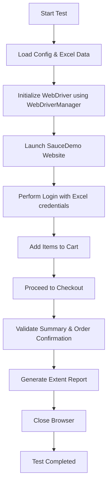

# 🚀 autodemo  
**Step-by-Step Automation Project Testing with Sauce Demo**

---

## 📦 Project Overview

This is an end-to-end **Selenium WebDriver automation project** using **TestNG**, **ExtentReports**, and other key tools. The test cases interact with [SauceDemo](https://www.saucedemo.com) and simulate real-world shopping flow scenarios.

🔐 **Login credentials and test data are dynamically read from an external `data.xlsx` file**, allowing for easy data-driven testing.

---

## 🛠️ Project Setup

This project was scaffolded using the Maven `maven-archetype-quickstart` template.

---

### ⚙️ Generate the Project (Optional for Reference)

```bash
mvn archetype:generate \
  -DgroupId=com.saucedemo \
  -DartifactId=autodemo \
  -DarchetypeArtifactId=maven-archetype-quickstart \
  -DinteractiveMode=false
```

#### 🔍 Command Breakdown

| **Command Part**                 | **Description**                                                               |
|----------------------------------|-------------------------------------------------------------------------------|
| `mvn`                            | Invokes Maven                                                                 |
| `archetype:generate`             | Uses the Maven Archetype plugin to scaffold the project                       |
| `-DgroupId=com.saucedemo`        | Base package structure (`com/saucedemo`)                                      |
| `-DartifactId=autodemo`          | Project name and folder                                                       |
| `-DarchetypeArtifactId=...`      | Uses the `quickstart` archetype                                               |
| `-DinteractiveMode=false`        | Runs non-interactively                                                        |

🗂️ Project structure created:

```
autodemo/
 └── src/
     ├── main/java/com/saucedemo/App.java
     └── test/java/com/saucedemo/AppTest.java
 └── pom.xml
```

---

## 📊 POM Dependencies

Here's the full list of dependencies used in `pom.xml`:

```xml
<dependencies>
  <dependency>
    <groupId>junit</groupId>
    <artifactId>junit</artifactId>
    <version>3.8.1</version>
    <scope>test</scope>
  </dependency>

  <dependency>
    <groupId>org.seleniumhq.selenium</groupId>
    <artifactId>selenium-java</artifactId>
    <version>4.31.0</version>
  </dependency>

  <dependency>
    <groupId>io.github.bonigarcia</groupId>
    <artifactId>webdrivermanager</artifactId>
    <version>6.0.1</version>
  </dependency>

  <dependency>
    <groupId>org.testng</groupId>
    <artifactId>testng</artifactId>
    <version>7.11.0</version>
    <scope>test</scope>
  </dependency>

  <dependency>
    <groupId>org.apache.poi</groupId>
    <artifactId>poi-ooxml</artifactId>
    <version>5.2.5</version>
  </dependency>

  <dependency>
    <groupId>com.github.javafaker</groupId>
    <artifactId>javafaker</artifactId>
    <version>1.0.2</version>
  </dependency>

  <dependency>
    <groupId>com.aventstack</groupId>
    <artifactId>extentreports</artifactId>
    <version>5.1.1</version>
  </dependency>
</dependencies>
```

---

## 📁 Data-Driven Testing

We use **`Apache POI`** to read from the `data.xlsx` file located in the project root or resources.  
It contains:

- ✅ Login credentials (`username`, `password`)
- ✅ Other test inputs like product names

The `ExcelUtil` class reads the `.xlsx` sheet and feeds data into tests dynamically.

---

## ▶️ Running the Tests

To execute a specific test class such as `PurchaseItem`, use:

```bash
mvn -Dtest=PurchaseItem test
```

Or run all tests:

```bash
mvn test
```

Skip test execution during build:

```bash
mvn clean install -DskipTests
```

---

## 🔄 Reload Dependencies

```bash
mvn dependency:resolve
```

---

## 🧭 Test Workflow (Visual Guide)

Here’s a simplified workflow of what happens when tests run:



---

## 📌 Summary

- 🔍 Built with **Maven**, **Java 17**, **TestNG**, **Selenium**, and **ExtentReports**
- 🧪 Supports **data-driven testing** with Excel via Apache POI
- 🧼 Easy to maintain and extend with modular page object classes

---
